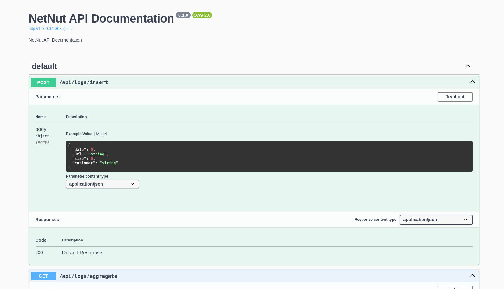
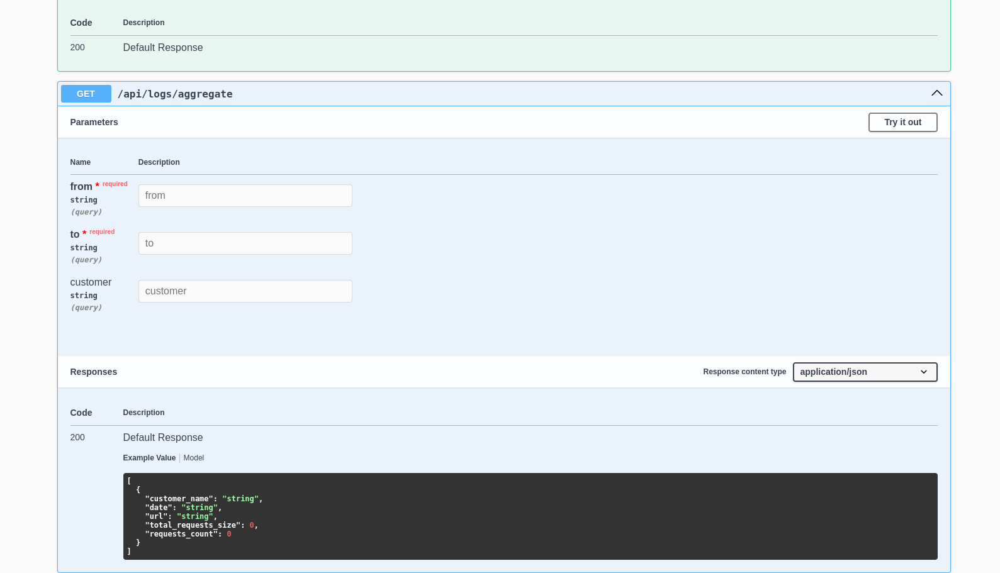
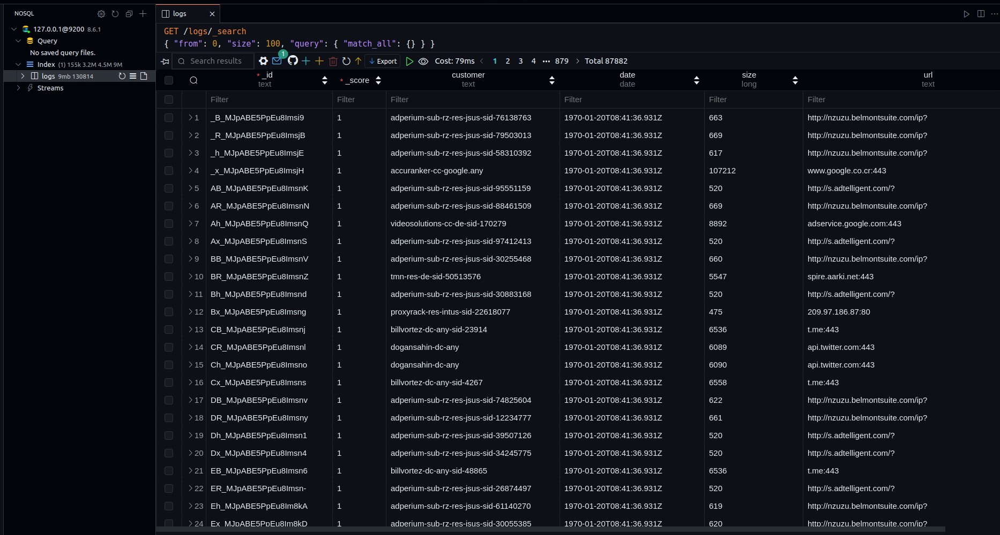

# Elastic Search & Node.js API

This is a simple API that uses elastic search to store and retrieve logs.

# Running instructions

1. Clone the repository

2. Run the elastic search server

```bash
docker compose -f ./dev/docker-compose.yml up -d elasticsearch
```

3. Run the following command to install the required packages

```bash
cd src
pnpm install
pnpm build
pnpm start
```

4. Run the script to create the index and add the data

```bash
cd src
pnpm run add-logs
```

4. Open the browser and navigate to `http://localhost:8080/` to view the swagger documentation

# Screenshots





# Technologies used

1. Node.js
2. Elastic Search
3. TypeScript
4. Fastify
5. Pino
